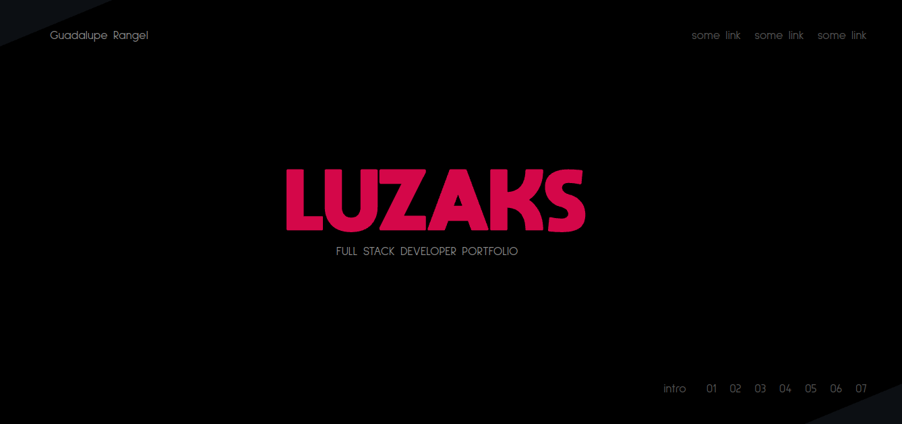

# Luzaks Portfolio.

In this repository you can find a summary of my personal built projects, my style of coding, my favorites stacks, and in general, you will know me as a developer.

Please enjoy the visit, navigate through the live demo, and wait for more, in the future definitely you will find more interesting things to see and play.

Thanks for comming.

## Preview

<div align="center"></div>

[<p align="center">Live Version</p>](https://luzaks.netlify.app/)

## Getting started

*   Click on the green button, in the repository. 
*   Add the following commands in your favorite bash:
```
git clone [copied text]
cd [repo name]
npm i
npm start
```

A tab will be opened in your default browser displaying the portfolio.


### 🛠 Built With

*   React.js
*   Three.js
*   React Three Fiber
*   Hooks
*   ES6
*   npm 
*   JSX
*   CSS
*   Netlify

<!-- CONTACT & SUPPORT -->
## Contact & Support

🙍 Guadalupe Rangel - kanemekanik@gmail.com - ☄

You liked it? ⭐️ Star the project!!!

Any comment that you want to send I'll be happy to receive it.
